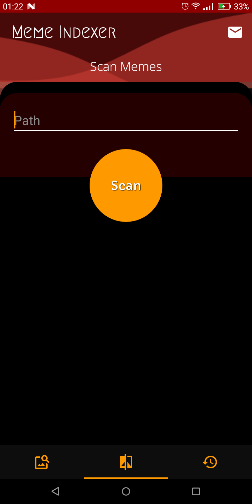
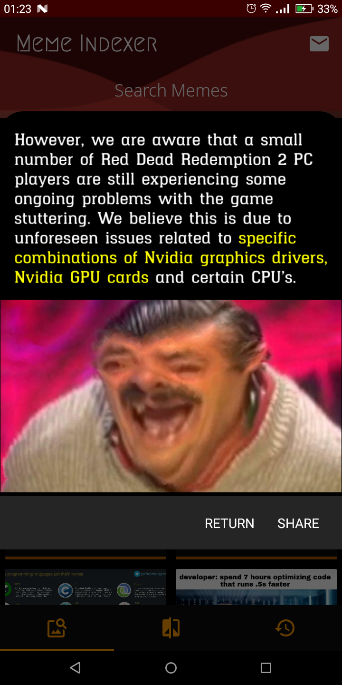

# Meme Indexer

Android app to ocr and index all the memes inside specified folder for later easier search and retrieval.

## What works - Basic features

- [x] Select folder and scan all memes inside it.
- [x] Search a given text and display matching memes.
- [x] Share searched meme from app.
- [x] Display searched memes in full size.
- [x] Display ocr'ed text
- [ ] functionality to edit ocr'ed text.
- [ ] Searchable meme tags
- [ ] Favourites
- [ ] Meme history
- [ ] Use foreground service, to prevent interruptions during indexing.
- [ ] Better app icons.
- [x] Take user feedback.

## Screenshots

Indexing    |   Searching
:----------:|:-----------:
 | 
| 
| 

## Plans

 - [ ] Improve the ocr model, currently using google's base default. Plan to use EAST with PyTorch, CRAFT gives better results but is much slower.
 - [ ] Just a thought... Read aloud the text from memes, like on request from the google assistant or something idk.
 - [ ] Switch between Black/White themes.
 - [ ] Deploy on cake day ez downloads and karma.

## Testing

 - I'll start releasing signed apks on github as soon as i'm done with the basic features. 
 - If you wanna test before that or develop... just clone this repo, point Android studio to the directory and let it do it's magic.

